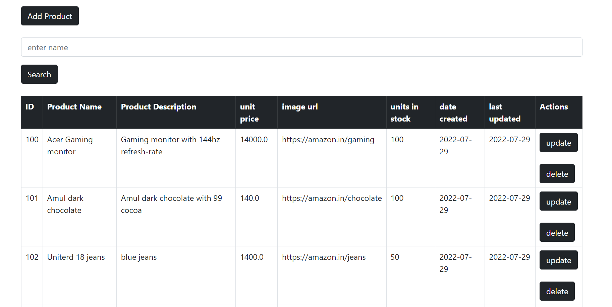
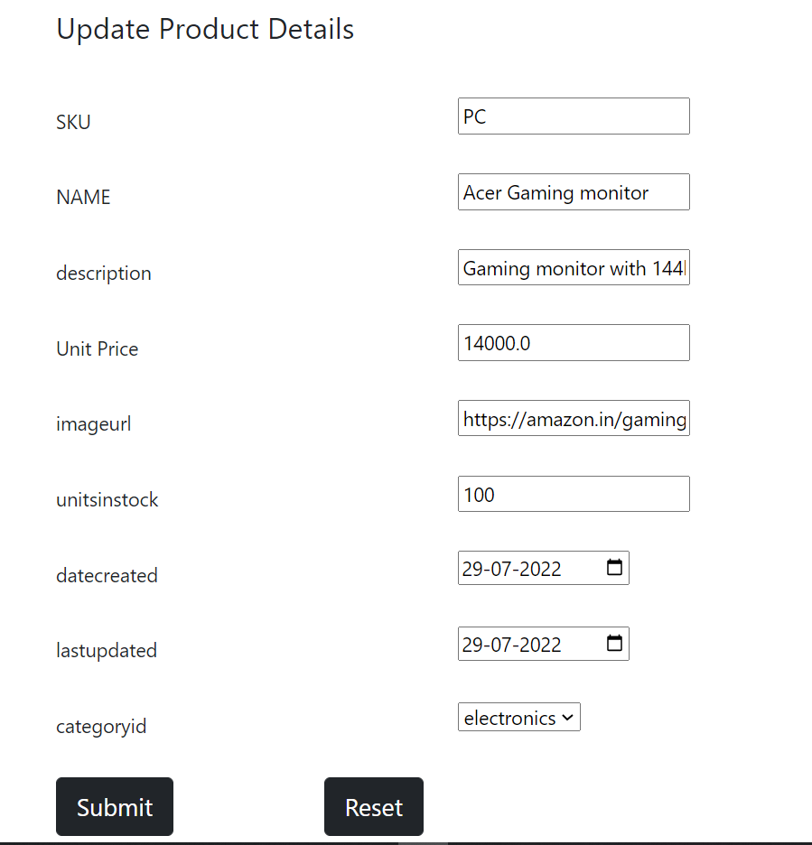
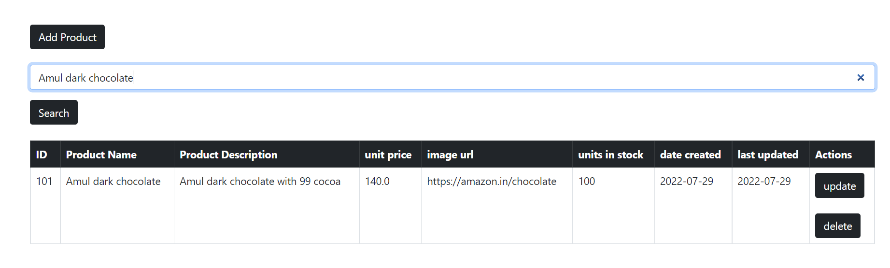
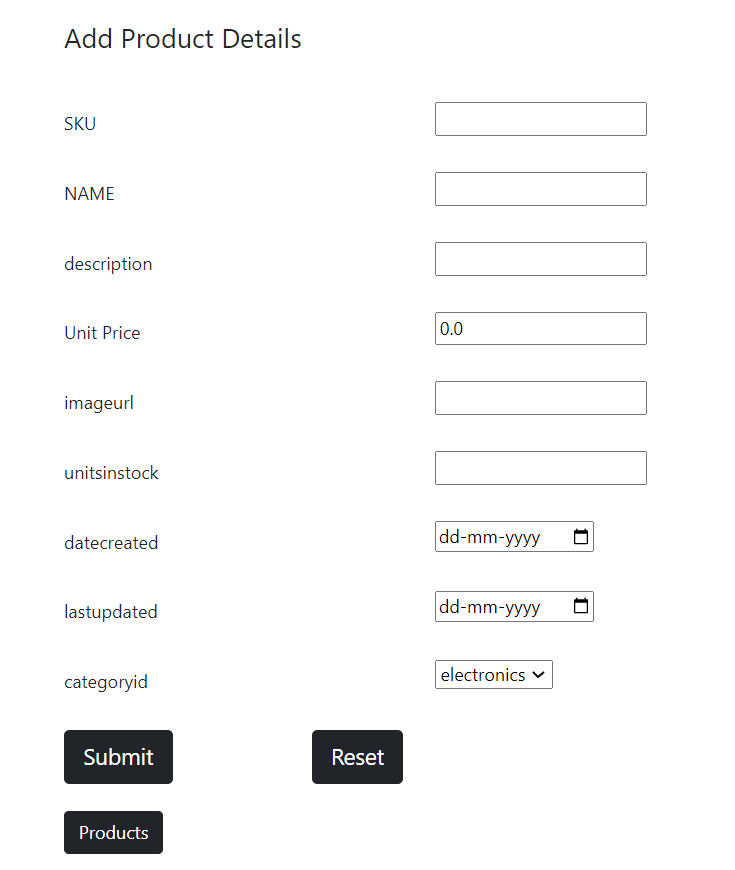

# Products Thymeleaf With sql
Following operatations performed
Add
Update
Delete
Display based on category
Search the product

**prerequisites:**
already atteched sql query file named database run it in mysql.

**screenshots**

